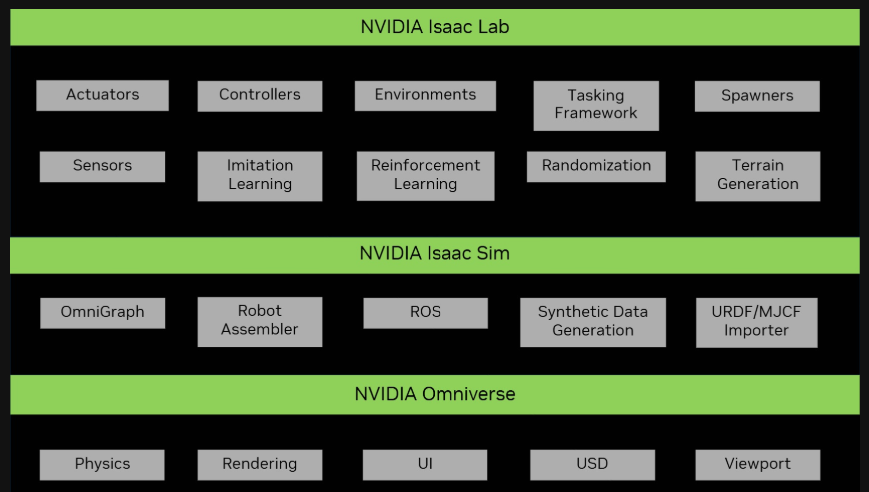
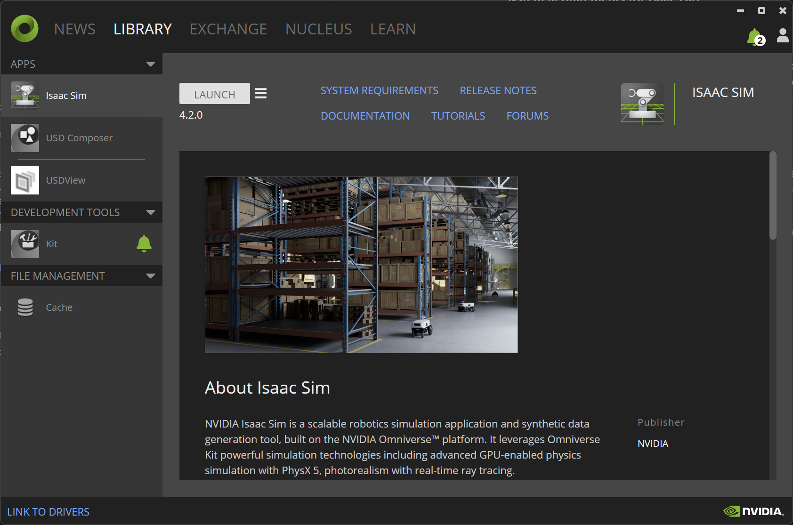
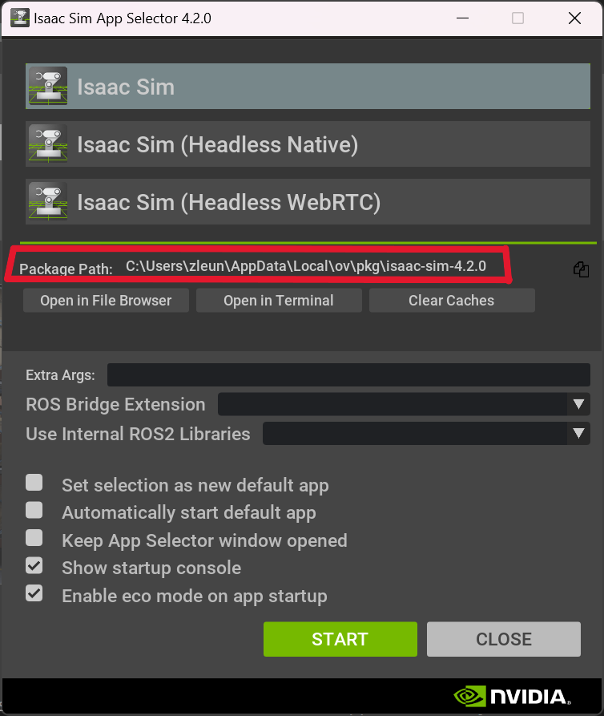

## What is Isaac Lab
Isaac Lab is the top layer of the three-layer structure of Omniverse Reinforcement Learning setup. 
At the bottom is the Nvidia Omniverse platform, which has most fundamental simulation tools such as physics, photorealistic rendering and USD scene creation. The middle layer is Isaac Sim which is packaged with a bunch of core robotic tools. Isaac Lab is built on top of Isaac Sim. It provides a flexible framework for robotic learning that exploits latest simulation technologies, such as reinforcement learning.



### System Requirements for Isaac Lab
The official website recommends system requirements with at least 32GB RAM and 16GB VRAM for Isaac Lab. (Note that Isaac Sim requirements is usually lower.)

## Install Isaac Lab on Windows
We will run Isaac Lab on our local machine.
Isaac Sim (IS) is required in order to run Isaac Lab (IL). The official installation guide recommends installing both IS and IL in the same "conda" virtual environment. However, I ran into a lot of trouble installing this way. Since I already have IS installed through Omniverse Launcher. I will show how to install IL without a conda environment. 

### Install Isaac Sim. 
If you refer to the official [installation guide](https://isaac-sim.github.io/IsaacLab/main/source/setup/installation/index.html) for IL, it will suggest installing IS in a conda envionment. This could be problematic for some Windows users, we will take an easier way: isntall it from Omniverse Launch. 

Go to the [installation guide](https://docs.omniverse.nvidia.com/isaacsim/latest/installation/install_workstation.html) for IS, and downnload the windows Installer. Follow the instructions. The Omniverse Launcher will look like the interface below. In the "EXCHANGE" tab and install "Isaac Sim" and "Cache".



To verify the installation, lauch Isaac Sim in LIBRARY tab. It will launch the simulator with a black stage.

### Install Isaac Lab.
This part is the same as the official [installation guide](https://isaac-sim.github.io/IsaacLab/main/source/setup/installation/index.html). Download the IsaacLab repository to your computer or clone it using git.

Here comes the key step. Before running `isaaclab.bat --install` as suggested by the guide,  we need to find the python interpretor that comes with Isaac Sim you have installed and replace the python path in `isaaclab.bat` file. You can find it in the Isaac Sim App Selector. For example, on my ocmputer the path is: `C:\Users\zleun\AppData\Local\ov\pkg\Isaac-sim-4.2.0\python.bat`.



Open the `isaaclab.bat` file using a text editor, locate to `:extract_python_exe` function, change the python exe path to `set python_exe="your_isaac_sim_python_path"`, as shown below. That's it, you odn't need to change anything else. The purpose is to force the script to use the python that comes with the IS you have already installed because it has all the dependencies to install IL.


```bat
rem extract the python from isaacsim
:extract_python_exe
rem check if using conda
if not "%CONDA_PREFIX%"=="" (
    rem use conda python
    set python_exe=%CONDA_PREFIX%\python.exe
) else (
    rem use kit python
    set python_exe="C:\Users\zleun\AppData\Local\ov\pkg\isaac-sim-4.2.0\python.bat"
)
rem check for if isaac sim was installed to system python
if not exist "%python_exe%" (
    set "python_exe="
    python -m pip show isaacsim-rl > nul 2>&1
    if %ERRORLEVEL% equ 0 (
        for /f "delims=" %%i in ('where python') do (
            if not defined python_exe (
                set "python_exe=%%i"
            )
        )
    )
)
if not exist "%python_exe%" (
    echo [ERROR] Unable to find any Python executable at path: %python_exe%
    echo %tab%This could be due to the following reasons:
    echo %tab%1. Conda environment is not activated.
    echo %tab%2. Python executable is not available at the default path: %ISAACLAB_PATH%\_isaac_sim\python.bat
    exit /b 1
)
goto :eof
```

You should be good to go! Follow the official guide and verify the installation. Don't forget to start your Cache server from Omniverse Launcher before doing so (otherwise it will be very slow.)

