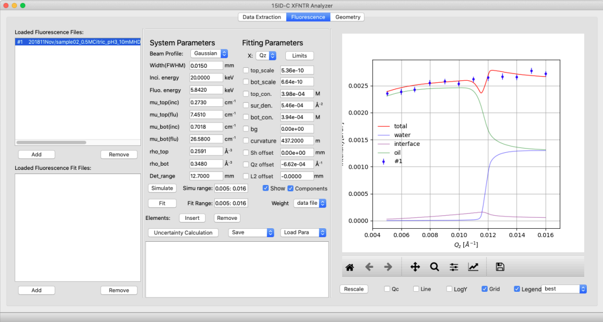
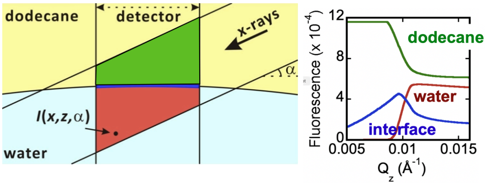
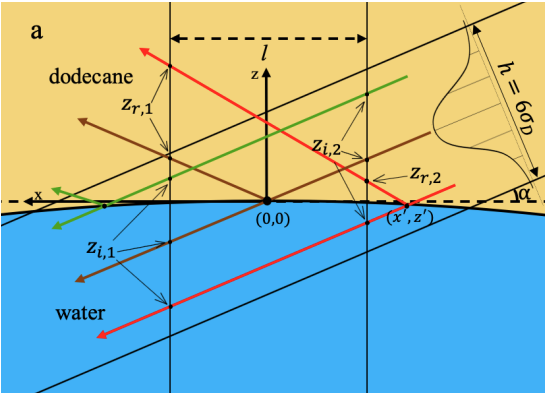
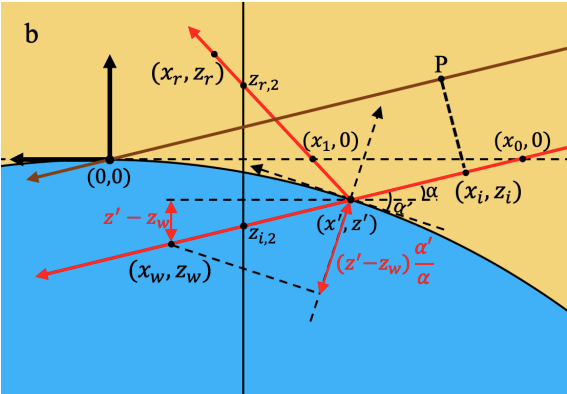

---
## Download
+ [code](https://github.com/zleung9/XFNTR)
---

## Software apperience
The left most column hosts data and fit files as described previously (see page 33); the middle column is the fitting panel which provides the values of all the parameters that characterize a fluorescence scan. The parameters fall into two categories. System parameters preset the sample and are known and fixed in the fitting. They include the energy and profile of the X-ray beam, its interaction with two bulk phases in terms of electron density, absorption coefficient, and the detection range of the fluorescence detector. Fitting parameters include all the unknown parameters to be optimized through the least-square fitting.

## X-ray fluorescence Near Total Reflection (XFNTR) Technique
XFNTR is used to measure the distribution of Eu throughout our samples by measuring the Eu interfacial number density (per nm²) and its concentration in each of the neighboring bulk phases. First introduced by Bloch and Yun, the elemental selectivity and surface sensitivity of XFNTR has been used to detect the existence and coverage of metal ions at liquid-vapor interfaces. The application of XFNTR has been limited to studying interfacial ion densities when the aqueous bulk concentration of ions is small enough to produce negligible fluorescence and the organic bulk concentration of ions is zero. However, during the process of solvent back-extraction, ions may have a substantial concentration in both bulk phases, as well as at the interface. Here, we discuss modifications to the measurement and analysis of XFNTR that allows us to measure the concentration of ions in both bulk phases, as well as the interfacial density of ions.

$$
\begin{aligned}[t]
    I(Q_z) = C & \left[n_{org}\iint I(x,z,Q_z)\,dx\,dz \right. \\
               & + n_{aq}\iint I(x,z,Q_z)\,dx\,dz \\
               & + \left. \sigma_{int}\int I(x, 0, Q_z)\,dx\right]+I_{bg}
\end{aligned}
$$

The final result is something like the one below:

$$
\frac{I(\alpha)}{I_0} = C \iint_{f/2}^{-f/2} w(x')\frac{I_{flu}(x')}{I_0}\,dx' + I_{bg}
$$

where 
$$
w(x') = \begin{cases}
\frac{1}{\sqrt{2\pi}\sigma_{D}/\alpha}\exp{-\frac{x'^2}{2(\sigma_{D}/\alpha)^2}}, &  -\frac{3\sigma_{D}}{\alpha} < x' < \frac{3\sigma_{D}}{\alpha} \\
0, & \text{otherwise}
\end{cases}
$$

and $I_{flu}(x')$ is an even more complicated term which won't be shown here. For detailed derivation of the equation please refer to my thesis.

